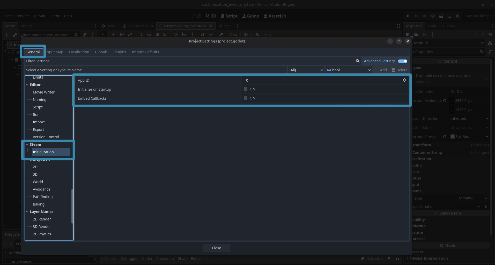

---
authors:
  - gramps
categories:
  - SDK
  - Patches
  - Tutorials
  - Skillet
date:
  created: 2025-04-01
---

# GodotSteam Updates For All Branches

Finally got all the updates for Godot 4.4.1 and Steamworks SDK 1.62 finished and rolled out some hefty changes for all the GodotSteam branches: godot4, godot3, gdextension, server4, server3, and server gdextension!  Steamworks SDK 1.62 brought a bunch of new Remote Play features and some minor changes to a few other classes; the docs still need updated for these changes and that will be coming this week.  The current in-editor docs should reflect these updates though; with the exception of the GDExtension ones.  For whatever reason, they are failing to display correctly again and that is another problem for another time.

One massive change is the ability to auto-initialize Steam _before_ the game starts; thanks to ***TriMay***.  This should fix the overlay issues with Forward+ that people have had.  While this does not fix overlay when running from editor, it should fix it if you were not able to get overlay running from the Steam client.  If you need this, you can enable it from a brand-new project settings: **Steam > Initialization**:

{ loading=lazy }

Wait, instead of calling **steamInit** or **steamInitEx**, now what? You can just easily replace either call in your code with `get_steam_init_result` and this will pass back the expected dictionary of values so very little has to change in your code if you use this initialization process.

In these new project settings, you can also set both your app ID and whether you want callbacks embedded here.  Setting them here means you do not have to set them if you call either **steamInit** or **steamInitEx**.  However, you **will** want to set app ID here if you are using auto-initialization.

Also, the initialization functions themselves have changed.  [**steamInit** now returns a bool](../../classes/main.md#steaminit), as Valve intended.  Both it and [**steamInitEx** now only take two arguments](../../classes/main.md#steaminitex): app ID and embed callbacks.  Originally, the first argument was a bool for pulling statistics or achievements at boot but that was removed in SDK 1.61 and we kept it to prevent breakage in projects.  However, it has now been removed which bumps up app ID and callback embedding. Used to be `Steam.steamInitEx(true, 480, true)` but now is `Steam.steamInitEx(480, true)`.

Expect an [initialization documentation update for this](../../tutorials/initializing.md) and a new short video too.  Also, embedding callbacks is now available on the GDExtension version too!

That being said, the planned tutorial for Statistics and Achievements got pushed back and instead the next one will be Leaderboards instead.  This way I can also release the leaderboards scene for Skillet to pair with that.

Speaking of Skillet, since there is more time currently, production is ramping back up and this week I will put together Github Project cards for tasks that need finished to better keep track of where the game is.  Those of you who expressed interest in working on the game will finally be able to chip in.  I will write up more on where Skillet is and what needs done in the next news update.

:heart: Gramps