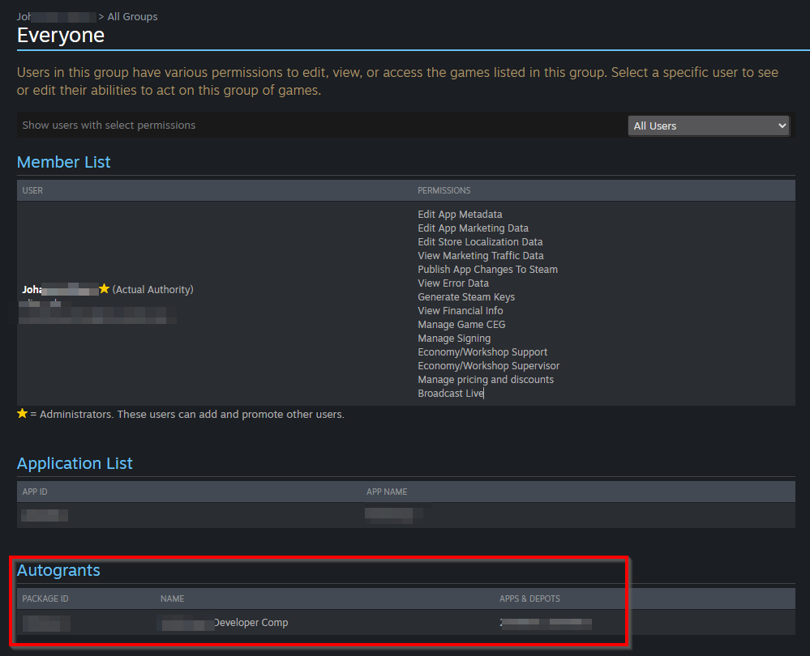

# Common Issues

What could possibly go wrong? Well, we will cover some of those common pitfalls people find themselves in. This should help you troubleshoot some of the basics for when things don't seem to be working.  You can also come ask questions on Discord.

{==
## Achievements, Stats, Leaderboard
==}

### Achievements Not Working

Sometimes your brand new achievements don't seem to be triggering. One cause can be that you didn't publish them in the Steamworks back-end. Once they are added into Steam's system, you'll need to publish the changes to be able to work with them.

Some users have also found that getting or setting achievements doesn't work at all until the player's current stats have been retrieved. GodotSteam should do this by default when you initialize Steamworks; unless, that is, you passed `false` to either `steamInit()` or `steamInitEx()`.  If so, just call `requestCurrentStats()` or `requestUserStats()`.

### Leaderboard Names

I haven't actually confirmed this yet, but it seems that a dash in the leaderboard name will cause it to fail. For example, ***this-leaderboard*** will probably not work but ***this_leaderboard*** will.

Also remember that leaderboards need to be published to be functional.

{==
## Don't Mix the Module and Plug-in
==}

On occasion folks will download the pre-compiled editor (module version) and then install the plug-in from the Godot Asset Library. This will result in a few weird errors as you will probably be making duplicate calls.

### Using Plug-In First

If you installed the plug-in and want to switch to the pre-compiled module, or your own compiled version; you'll need to completely remove the plug-in from you project's folder and in the settings.

If using Godot 4 and the GodotSteam GDExtension, check in the .godot folder for any traces of the extension in your extension_list.cfg and remove it.

### Using Module First

If you are coming from the pre-compiled modules versions and want to switch to the plug-ins, make sure you remove the Steam shared library file (steam_api64.dll, libsteam_api.so, or libsteam_api.dylib) from either the root of your project or sitting next to your editor executable.

In some cases, this will prevent the plug-in from loading correctly.

{==
## Double-Precision Editor Crashes
==}

If you are using Godot Engine that has double-precision enabled, using the GDNative or GDExtension plug-ins may crash the editor as they are not compiled with double-precision.

If you need this feature, you will need to self-compile the editor or plugi-ns.

{==
## GDNative
==}

GDNative has some additional quirks to its usage. If these issues impact your game's development or release, please switch to the GodotSteam 3 pre-compiled editors and templates **after** uninstalling the GDNative plug-in.

### No Enums or Constants

There is no way to access Steam's enums or contants in GDNative.

### Rich Presence

Rich presence will work fine on all operating systems _except_ Windows.  It will occasionally make the value the key on random calls.

[Thankfully, Furcifer shared some code to help with this issue. You can read more about it in the Rich Presence tutorial!](../tutorials/rich_presence.md)

### Getting Lobbies

For whatever reason, the get lobby callback would not return a single array like everything else so the callback will send an array of lobbies and the total count.

{==
## Initialization
==}

### steam_appid.txt.txt

If you aren't using the environment variables to set what game you're running, then you're probably using the older method of seatting your game's app ID in the `steam_appid.txt` file. For Windows users, when creating the `steam_appid.txt` file you need to watch out for the dreaded `.txt.txt` extension. If you have extensions hidden in the file explorer, this is more likely to happen since you can't see that extra `.txt`. If you do have them hidden, make sure to skip adding `.txt` to the end.

### Error 79 When Initializing

This can have quite a few causes but a common one is not having your depots or packages set up correctly. Check out [the packages page in the official Steamworks SDK documentation](https://partner.steamgames.com/doc/store/application/packages){ target="\_blank" } for more on how to do it.

### Error `steam ConnectToGlobalUser failed.`

This error may be seen on initialization. This can have a few causes:

- Steam is not started
- The currently signed-in user does not have access to the game (i.e. it's not in the users Steam Library)

{==
## Parse Error
==}

Some people get `Parse Error: The identifier Steam isn't declared in the current scope`. If you get this error, one of the following is the cause:

- Either you're not using a pre-compiled editor.
- You didn't actually include GodotSteam in your build when compiling.
- You're using a non-GodotSteam template when exporting from a GodotSteam-enabled editor.
- Your GDExtension files may be out-of-date with your .gdextension file.

{==
## Steam Client
==}

### Game Does Not Appear In Steam Library

When you do not have access to the game you created, you likely haven't received a grant for it!
If you have created the Steam App with the currently signed-in account, you should have received an [autogrant](https://partner.steamgames.com/doc/store/application/packages/autogrants).
To check whether you have an autogrant, go to:

1. Your Steam Dashboard
2. Under _Users & Permissions_
3. Select _Overview_

Make sure, the `Developer Comp` package is there, as shown in the screenshot below:

If it is **not** there, you need to add it. To do this, click the `Add/Manage Groups` button on this very screen.
Then, on the next screen, select the Group for your app that includes your account (likely called `Everyone`, which includes all partner account members).
On the next screen, you should then be able to add the autogrant:

{==
## Steam Inputs
==}

### Steam Eating Godot's Inputs

Sometimes Steam will "eat" inputs meant for Godot so you get no controller responses. If you aren't using Steam Inputs class, you can go into the game's setting and just turn Inputs off.  This will allow Godot to resume getting input data.

{==
## Steam Overlay
==}

### Forward+ / Vulkan

Every so often folks will find that Steam overlay does not work or flickers when running their project from the Godot 4.x editor or a standalone Forward+ build outside of Steam. This has been the case since the Godot 4 alpha builds. Steam overlay _should_ work fine when using Compability / OpenGL mode.

The Steam overlay will render correctly once a Forward+ build is run from the Steam client itself, as Steam injects the overlay during boot. When run from Steam as a Non-Steam app, the overlay will display correctly, but won't be tied to the app ID, so achievements and game artwork won't show up inside the overlay.

#### Driver Updates

Certain driver versions on GPUs will allow Steam overlay to work with Forward+ mode. If the overlay isn't working, you may want to try changing version numbers.

A user also reported that with NVidia driver version 546.33, in Forward+ mode, that the game stuttered / jittered a bit when Steam was initialized. However, the stuttering went away when switching to Compatibility mode.

#### Other Solutions

There is also a nice video about getting overlay to work without messing with drivers, thanks to FinePointCGI:

[ :simple-youtube: 'How To Fix Your Steam Overlay' by FinePointCGI](https://www.youtube.com/watch?v=VCwNxfYZ8Cw&t=6725s){ .md-button .md-button--resource target="\_blank" }
