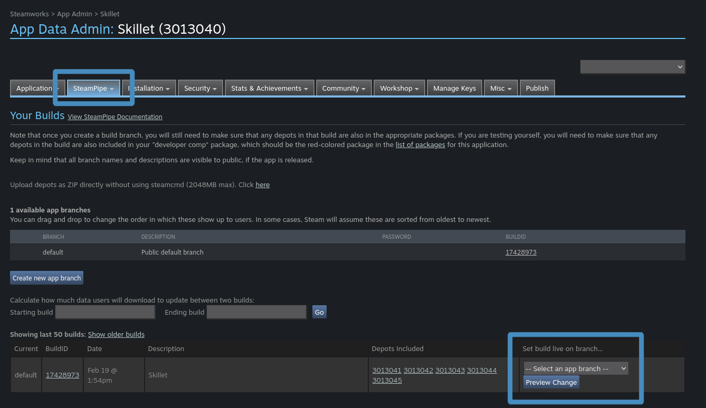

# Tutorials - Exporting and Shipping
:material-badge-account-horizontal: _By Gramps_

---

Exporting and shipping is one of those things that tends to get a little confusing, especially on the Steamworks side.  Once you have a good workflow sorted out, it should be easy sailing from there.  You should also read through [Valve's documentation about uploading your game to Steam which goes into a lot of this more thoroughly and covers some things we don't.](https://partner.steamgames.com/doc/sdk/updating){ target="\_blank" }

In this tutorial we will cover exporting from Godot and setting things up in Steamworks so you can use your builds from the Steam client.  So let's get into it!

{==
## :material-view-module: Exporting Your Project
==}

### From Modules / Pre-Compiles

To being our export process, first click on the "Project" button in the top menu then select "Export..." from the drop-down.

{ loading=lazy }

In this example, we are only using the release template which must be specified in the **Customer Templates > Release** field. If you need debugging as well, make sure to add it to the **Debug** field too.

{ loading=lazy }

!!! warning "Note"
	If you use a non-GodotSteam template or leave these fields blank, you will end up with an executable that crashes like so:

	```
	Parse Error: The identifier "Steam" isn't declared in the current scope.
	```

	This happens because the Steamworks API is not present without a GodotSteam-enabled template and the executable will not be able to find the object nor use the functions. 

On the last export screen, just before the process begins, make sure you turn the debugging option off if you are only using the release template.

{ loading=lazy }

If you are using a debug template you can actually leave this on but for our example we turn it off.

### From GDNative / GDExtension

When using the **GDNative or GDExtension** version of GodotSteam, you will need to use the **regular Godot templates** either installed through the regular Godot editor or [downloaded from their site](https://godotengine.org){ target="\_blank" }.

Basically follow the usual steps for exporting a project from Godot, as shown above in the **modules / pre-compiles** section except **do not** use the GodotSteam templates.  That will cause a lot of issues.

Also take note of any additional files Godot exports for you like the godotsteam.dll / libgodotsteam.so / libgodotsteam.dylib because these must also be shipped with your game.  They create the bridge for the game and Steamworks.

### Without Steam

If you followed our [guide about how to remove Steam from your game](remove_steam.md) without maintaining multiple code-bases, you probably don't want the extra files either.  Thankfully ***AdriaandeJongh*** shared the information with us and a handy image too:

> I found that as long as you don't call any methods on the Steam class provided by this plugin, you can actually simply not export those binaries like so...

{ loading=lazy }

While this may work with the plug-ins, you will still have to ship the Steam API shared libraries (steam_api64.dll, libsteam_api.so, libsteam.dylib) if using the pre-compiled editor / templates since Steam is always present.  There is an upcoming patch that should remove this crashing behavior if they are missing though; no current ETA on that at this time.  

{==
## :simple-steam: Setting Up Steam Depots
==}

Before moving on to uploading our files, we need to set up our Steam depots to send them to.  [You will have to log into the Steamworks partner site](https://partner.steamgames.com){ target="\_blank" } then access your game's landing page.  You will want to navigate down to the **Technical Tools** section then click on the **Edit Steamworks Settings** option.

{ loading=lazy }

From this page, you will want to click on the **SteamPipe** section then click on the **Depots** drop-down to access the depots page.  As you can see below, we have depots set up for our shared content and each major platform; Windows having two separate ones for 32-bit and 64-bit.

{ loading=lazy }

Just click on the **Add New Depot** and give it whatever name you want then click on the **Edit** button for the new depot to set the operating system and architecture.  You can do any manner of combinations based on how and what you want to ship.

Please write down or copy the depot IDs as we will be using them a lot in the next step.

{==
## :material-file-plus: Setting Up For SteamCMD
==}

If you want a more fine-tuned uploading process for Steam that can be integrated into build systems, we will want to set up SteamCMD.  This is typically how I have mine set up.

However, if you just want to skip all of this and directly upload zipped builds to the Steamworks partner site, [you can navigate down to the Upload Through Website (optional) section.](#upload-through-website-optional)

### Gather Your Project Files

Before sending things over to Steam, we need to gather up all our files.  For the most part this is just your game's executable, accompanying .pck file, GodotSteam shared libraries if you are using the plug-ins, and the Steamworks API file:

- On Linux, make sure you use the **libsteam_api.so** file from the _correct_ folder. I am not sure why Valve did not differentiate in naming between 32 and 64-bit files for Linux, but they do not.
- On Mac, the Steamworks redistributables are already included in your app directory so there's not thing else to add.
- On Windows, use the **steam_api.dll** for 32-bit or **steam_api64.dll** for 64-bit.

!!! warning "Notes"
	
	If you are using a **steam_appid.txt** for setting your game's app ID instead of passing it to the initialization function or setting it as an environment variable, you will not want to include it with your upload files. This file is ***only*** used for running your game ***outside of the Steam client*** so that it knows which game you are playing. When running ***through the Steam client***, Steam is aware of what game you are playing, thus it is not necessary. Valve recommends that you do not ship this file with your game, as [it can potentially cause issues](https://partner.steamgames.com/doc/api/steam_api#SteamAPI_RestartAppIfNecessary){ target="\_blank" }.

	Also, if you are shipping on Mac, there are a few extra steps you may want to check out. Instead of repeating it here, you can [read more about the process in the Mac Exporting tutorial](mac_export.md).

### Get SteamCMD Setup

To get SteamCMD, used to upload games to Steamworks, you can use one of two methods:

- [Download the Steamworks SDK from the partner site](https://partner.steamgames.com){ target="\_blank" }
- [Follow Valve's guide to getting _just_ SteamCMD itself here.](https://developer.valvesoftware.com/wiki/SteamCMD#Downloading_SteamCMD){ target="\_blank" }

For this step in the tutorial, we will be working with the Steamworks SDK download version.  After unzipping it you will see a **tools** folder that contains a lot of different subfolders and zips.  You can extract this folder where ever you want.  You may noticed the **SteamPipeGUI.zip**, which is an [uploader for Windows that Valve created](#upload-through-gui-optional) and we will talk about later on.

{ loading=lazy }

The main folder here we will be working with is the **ContentBuilder** folder, specifically the **content** and **scripts** folders.

{ loading=lazy }

### Placing Your Content In

In our **content** folder we will create a folder for your project.  This tutorial is using the [files from Skillet, which is app ID 3013040,](https://store.steampowered.com/app/3013040/Skillet/){ target="\_blank" } so we are naming our folder by this app ID and all sub-folders by their respective depot IDs.

{ loading=lazy }

Inside this new folder, we will create the following sub-folders [based on the individual depots set up in the Steamworks back-end we did in the previous section](#setting-up-steam-depots).  You will want to alter these to fit whatever setup you have for your project, but here is how ours is set up:

- Shared content (3013041): anything all platforms share, primarily the .pck in this case
- Linux (3013044)
- Mac (3013045)
- Windows 32-bit (3013043)
- Windows 64-bit (3013042)

{ loading=lazy }

For a brief peek inside, here is what the shared content (3013041) folder and the Linux (3013044) folder look like:

{ loading=lazy }

{ loading=lazy }

### Create VDF Files

Now that everything is in place, we will move over to the VDF files which tell SteamCMD where everything is and how to upload it.  [You can read Valve's documentation on how they are written](https://partner.steamgames.com/doc/sdk/uploading#3){ target="\_blank" } or you can [see how Skillet's are set up here.](https://github.com/GodotSteam/Skillet/tree/assets/steamworks/vdfs){ target="\_blank" }

The VDF scripts are similar to JSON and require only a few things to be filled out.  For the main app VDF:

```
"AppBuild"
{
	"AppID" "3013040"
	"Desc" "Skillet"

	"Preview" "0"
	"Local" ""
	"SetLive" ""
	"ContentRoot" ""
	"BuildOutput" "..\output"
	"Depots"
	{
		"3013041" "..\scripts\3013041.vdf"
		"3013042" "..\scripts\3013042.vdf"
		"3013043" "..\scripts\3013043.vdf"
		"3013044" "..\scripts\3013044.vdf"
		"3013045" "..\scripts\3013045.vdf"
	}
}
```

Then for our Linux depot's VDF file:

```
"DepotBuild"
{
	"DepotID" "3013044"
	"ContentRoot" "..\content\3013040\3013044\"
	"FileMapping"
	{
		"LocalPath" "*"
		"DepotPath" "."
		"Recursive" "1"
  }
}
```

All our VDF files will live inside the **scripts** folder.  Typically I just dump these in here since they are all uniquely named files, but you could separate them into sub-folders per project if you like.

{ loading=lazy }

### Uploading Files Through SteamCMD

Back in our **ContentBuilder** folder, you will find three different folders that contain the SteamCMD executable and related .sh scripts if you are using Linux or Mac.  Depending on your operating system:

- Linux: give execution permissions to the steamcmd.sh file then run it
- Mac: give execution permissions to the steamcmd.sh file then run it
- Windows: run the steamcmd.exe file

!!! warning "Notes"

	In all cases, SteamCMD does not work like other command prompts / terminals in that you cannot press the arrow up key to cycle through previously entered commands.  Anyone who works with command prompts / terminals may do this instinctively and find it a bit irritating.  You must re-type commands if they fail or copy / paste them in.

To start, you will need to log into the Steam account that has access to the Steamworks back-end; for most people this is probably your primary Steam account.

```
login <your username>
```

It will then prompt you for your password and probably your Steam Guard code if you have that enabled.  Once you get logged in, you will just run this simple command to start the upload process:

```
run_app_build ../scripts/3013040.vdf
```

Please note this is using the default locations for our scripts folder and Skillet's main app VDF.  Once that starts running, you should see output similar to this:

{ loading=lazy }

At this point, all of your files should have been sent over to Steam and are ready to be enabled in the Steamworks back-end for testing, submission, and/or distribution.  If you get any errors about missing depots or such, double-check your depot VDF files.

{==
## :material-upload: Upload Through Website (Optional)
==}

If you want to skip all that SteamCMD stuff and just directly upload each depot's files, you can do that through the Steamworks website itself.  This process is clearly much simpler but does not allow for some more complicated setups that most developers probably aren't going to use anyway.

You will find this option in the SteamPipe builds section in the app's back-end.

{ loading=lazy }

As you can see below, this uses the depots we set up earlier; each depot has a field where you just upload a zip file and then Steamworks unzips these and places them appropriately.

{ loading=lazy }

After you upload all your zips, we can move on to the last step which is enabling the game for testing, submission, and/or distribution.

{==
## :material-open-in-app: Upload Through GUI (optional)
==}

As another alternative to uploading your project files through either SteamCMD or the Steamworks website, you can unzip and use Valve's long-abandoned-yet-functional SteamPipe GUI.  This method still requires setting up a bunch of things as you would in the SteamCMD process but, instead of running the executable, you would use this GUI to effectively do the same thing.

As I do not use Windows, I do not have any screenshots of it but you fill out all the relevant data:

- Add your depots
- Point it to your content folders and VDF script folders
- Enter your Steam credentials

Then just run it and it should open up the SteamCMD command prompt and push everything to SteamPipe.  From my perspective, the only thing this option does is save you logging in and running a command.  Though there is an option to have it generate VDF files based on the content folders you point it to.

{==
## :material-shipping-pallet: Shipping
==}

Before we can make this live for testing or users, we need to finish a few last steps: setting executables, checking packages, and setting up the builds.  The first two could have happened long before we started pushing files to Steam but we'll just cover them now.

We will go back into the Steamworks back-end and, like earlier, navigate to the app's landing page.

{ loading=lazy }

### Setting Executables

You will want to navigate over to the **Installation** tab then down to **General Installation**.  As you see here, we have launch options set up for Linux and Windows.  The most important part is setting the **executable** field to whatever your game's executable name is  and the **operating system** field so Steam know what to run on what platform.

{ loading=lazy }

At the bottom of the page, click the **Add new launch option** to set up a new launch option then press the **Edit** button to set all the appropriate fields.

### Checking Packages

Back on the main app landing page, you will want go to the **View Associated Items** section then click the only option: **All Associated Packages, DLC, Demos, and Tools**.

{ loading=lazy }

This will bring us to the Associated Packages & DLC page which houses information about things like your game's demo, playtests, soundtracks, tools, and all related packages.

{ loading=lazy }

At the very bottom of this page is what we really are concerned with: **beta testing and devcomp packages**.  These are required for you to get the game in your Steam library and for your testers to be able to try out the game prior to launch.

{ loading=lazy }

We will start with the beta testing package by clicking on the yellow bar which will open the follow page up.  In here we will want to make sure all of our related depots are included in this package or it will not work correctly.  If you do not see the right depots here, just click on the **Add/Remove Depots** button and select the depots that should be present, one by one.

{ loading=lazy }

With everything set up for beta testing, go back to the previous page and click on the red bar to set up our dev comps.  This follows basically the same process as beta testing, you want to make sure all your depots are listed and, if not, add them to the list.

{ loading=lazy }

So now we should be completely set up and ready to make all those uploaded depots live on Steam.

### Setting Builds

Head back to the game's landing page and navigate down to the **Technical Tools** section then click on the **Edit Steamworks Settings** option.

{ loading=lazy }

From here we then go to **SteamPipe** again but this time select the **Builds** option.  Here you should see the newly uploaded files with the new build ID and all the depot IDs you uploaded.  All the way on the right, there is a drop-down to select which branch you want to push these changes to.  By default, ironically, is the **default branch** which is your main public branch. You can set up as many branches as you want, like ones for betas, and even password protect them from this page.

{ loading=lazy }

Pressing **Preview Changes** will let you set any internal notes and then set your build as active.  You used to have to publish these changes on a separate page but now they should become live once you do this.

Afterwards, you should be able to install your game through the Steam client or, if your game is already on Steam, you should shortly see an update available notification on the Downloads page.  And that's that for exporting and shipping!

{==
## :material-content-save-settings: Additional Resources
==}

### Video Tutorials

Prefer video tutorials? Feast your eyes and ears!

[ :simple-youtube: 'Godot + Steam tutorial | Export' by BluePhoenixGames](https://www.youtube.com/watch?v=J0GrG-AffCI&t=49s){ .md-button .md-button--resource target="\_blank" }

[ :simple-youtube: 'How Do You Export Your Game' by FinePointCGI](https://www.youtube.com/watch?v=VCwNxfYZ8Cw&t=6538s){ .md-button .md-button--resource target="\_blank" }