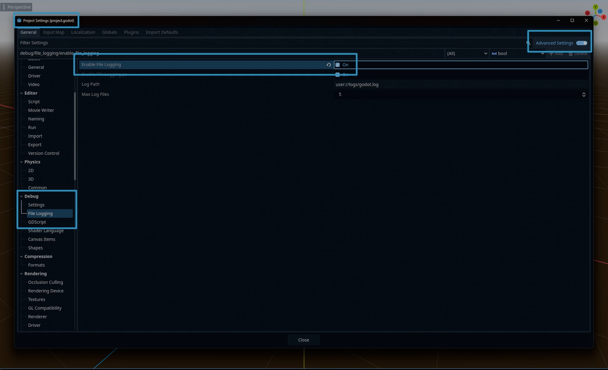

# Tutorials - Initializing Steam

In this tutorial, we will cover the basic initialization of Steamworks in your game; as well as getting callbacks globally. [Check out the common issues tutorial if](common_issues.md) you have issues getting things to work too.

Please note, this tutorial is only valid for the module and GDExtension versions of GodotSteam; the GDNative version will already have these functions present in the `steam.gd` autoload script.

<div class="start-grid" markdown>

!!! guide "Relevant GodotSteam classes and functions"
	* [Main class](../classes/main.md)
		* [steamInit()](../classes/main.md#steaminit)
		* [steamInitEx()](../classes/main.md#steaminitex)
		* [run_callbacks()](../classes/main.md#run_callbacks)
	* [Apps class](../classes/apps.md)
		* [isSubscribed()](../classes/apps.md#issubscribed)
	* [Friends class](../classes/friends.md)
		* [getPersonaName()](../classes/friends.md#getpersonaname)
	* [User class](../classes/user.md)
		* [getSteamID()](../classes/user.md#getsteamid)
		* [loggedOn()](../classes/user.md#loggedon)
	* [Utils class](../classes/utils.md)
		* [isSteamRunningOnSteamDeck()](../classes/utils.md#issteamrunningonsteamdeck)
</div>

---

## Preparation

Before we go any further, it is recommended that you enable logging in your project if you have not done so. This will help both you, and us, debug any issues you might run into down the road.

Of course, if you have a custom logging system, don't worry about this.

=== "Godot 2.x, 3.x"
	To enable logging in the Godot editor, go to: **Projects > Project Settings > Logging > File Logging** and check **Enable File Logging**. This will start placing logs in your project's user data folder. Where are these, you might ask?  [Check out the official Godot Engine documentation to find the locations.](https://docs.godotengine.org/en/stable/tutorials/io/data_paths.html?highlight=user%20data){ target="\_blank" }

	{ loading=lazy }

=== "Godot 4.x"
	To enable logging in the Godot editor, go to: **Projects > Project Settings > Debug > File Logging** and check **Enable File Logging**. This will start placing logs in your project's user data folder. Where are these, you might ask?  [Check out the official Godot Engine documentation to find the locations.](https://docs.godotengine.org/en/stable/tutorials/io/data_paths.html?highlight=user%20data){ target="\_blank" }

	{ loading=lazy }

---

## Steam App ID

When the game is run through the Steam client, it already knows which game you are playing. However, during development and testing, you must supply a valid app ID somehow. Typically, if you do not already have an app ID, you can use app ID 480 which is Valve's SpaceWar example game.

You can set the app ID in one of three ways, depending on what is easiest for you:

### Method 1: steam_appid.txt

Create a steam_appid.txt file and with _only_ the app ID as the text. This file must be where ever your regular Godot or GodotSteam-enabled editor is located. Though, in the case of plug-ins, sometimes it must be in the root of your project to work correctly.

Also, when shipping your game to Steam, do not include this file as it is not needed. Granted it won't hurt anything if you do.

### Method 2: Pass It To Initialization

You can pass the app ID to either `steamInit` or `steamInitEx` to set it during initialization. This will be the second argument passed; the first being whether you want the local user's statistics and achievements to be pulled during the initialization.  For example:

```gdscript
var initialize_response: Dictionary = steamInitEx( true, 480 )
print("Did Steam initialize?: %s " % initialize_response)
```

If you use this method, you **must** pass a true or false as for the first argument.

!!! warning "Notes"
	This functionality **does not** exist in GDNative. It only exists in GodotSteam 3.22 and up for Godot 3.x and GodotSteam 4.5 and up for Godot 4.x and GDExtension.

### Method 3: Set Environment Variables

You can set two environment variables in an autoload GDscript or the first GDscript to run; preferably the script where you run the Steam initialization function and preferably in the `_init()` function. For example:

```gdscript
func _init() -> void:
	# Set your game's Steam app ID here
	OS.set_environment("SteamAppId", str(480))
	OS.set_environment("SteamGameId", str(480))
```

Thanks to user **B0TLANNER** for providing this method.

---

## Initialize Steam

In my personal projects, I usually create an auto-load GDscript called `global.gd` which is added as a singleton.

I then create a function called `initialize_steam()` and add the code below. This is then called from the `_ready()` function in my `global.gd`:

```gdscript
func _ready() -> void:
	initialize_steam()


func initialize_steam() -> void:
	var initialize_response: Dictionary = Steam.steamInitEx()
	print("Did Steam initialize?: %s " % initialize_response)
```

By default, `steamInitEx()` will query Steamworks for the local user's current statistics and send this data back as a callback (signal). You can pass a boolean (false) to the function to prevent this behavior: `steamInitEx(false)`.

`steamInitEx()` will always send back a dictionary with two keys / values:

- verbal - The verbose, text version of status
- status
	- 0 - Successfully initialized
    - 1 - Some other failure
	- 2 - We cannot connect to Steam, steam probably isn't running
	- 3 - Steam client appears to be out of date
---

## Checking For Errors

The returned dictionary from `steamInitEx()` can be printed and ignored. However, there are certain conditions where you might not know why the game crashed at boot or does something unexpected; especially in development. For these cases we will check if Steamworks was actually initialized and to stop the game if anything is amiss, we do this:

```gdscript
func initialize_steam() -> void:
	var initialize_response: Dictionary = Steam.steamInitEx()
	print("Did Steam initialize?: %s" % initialize_response)

	if initialize_response['status'] > 0:
		print("Failed to initialize Steam, shutting down: %s" % initialize_response)
		get_tree().quit()
```

This code will obviously shut down the game if Steam does not initialize and returns a status of anything except 0.  You may just want to capture the failure data and continue on, though the Steamworks functionality won't quite work.

Most times, in development, getting a failure will probably be caused by a missing API file (steam_api.dll, libsteam_api.so, libsteam_api.dylib) or not setting the game's app ID by one of the methods mentioned earlier.

In any case, the intialization functions should give you a pretty good idea of why it failed. If you still cannot figure it out, please contact us for assistance!

---

## Getting More Data

There are a ton of functions you can call just after initialization to gather more data about your user; everything from location, to language used, to avatars, etc. We will just cover some basic things that are commonly used:

```gdscript
var is_on_steam_deck: bool = Steam.isSteamRunningOnSteamDeck()
var is_online: bool = Steam.loggedOn()
var is_owned: bool = Steam.isSubscribed()
var steam_id: int = Steam.getSteamID()
var steam_username: String = Steam.getPersonaName()
```

This will check if Steam is online, if the app is running on the Steam Deck, get the current user's Steam ID64, and check if the current user owns the game. You can also have the game turn itself off if the current user does not own the game by simply doing this:

```gdscript
if is_owned == false:
	print("User does not own this game")
	get_tree().quit()
```

!!! warning "Notes"
	Shutting the game down with this **is_owned** behavior might cause problems from people using Family Share, Free Weekends, or other methods of trying the game out. There are other functions to check for those conditions which you might want to consider.

There are other things you may want to do during a boot-up process after Steamworks is initialized, like getting current achievements or statistics, but we'll cover that in another tutorial.

---

## Callbacks

A very important piece of Steamworks is getting callbacks from Steam itself in response to different function. To receive callbacks you will need to have the `run_callbacks()` function running somewhere; preferably every frame or so.  There are two methods available:

### Method 1: Add It To \_process()

The standard method has been adding the `Steam.run_callbacks()` function to the `_process()` function like so:

```gdscript
func _process(_delta: float) -> void:
	Steam.run_callbacks()
```

I highly suggest, much like the initialization process, you put this `_process()` function with the `Steam.run_callbacks()` in a global (singleton) script so it is always checking for callbacks. Though, if you want, you can put it in any `_process()` function in any given script that might be using callback information.

### Method 2: Pass It To Initialization

You can pass true as the third argument to either initialization function and have GodotSteam check for callbacks internally. Like so:

```gdscript
var initialize_response: Dictionary = steamInitEx(false, 480, true)
print("Did Steam initialize?: %s " % initialize_response)
```
However, you must pass the first two arguments which are whether you want the local user's statistics and achievements pulled during initialization and the game's app ID.

!!! warning "Notes"
	The argument **does not** exist in the GDExtension version currently. This only works in GodotSteam 3.22 or newer for Godot 3.x and in GodotSteam 4.5 or newer for Godot 4.x.

---

## Altogether Now

Putting it together should give us something like this:

=== "Without internal app ID and callbacks"
	```gdscript
	extends Node

	# Steam variables
	var is_on_steam_deck: bool = false
	var is_online: bool = false
	var is_owned: bool = false
	var steam_app_id: int = 480
	var steam_id: int = 0
	var steam_username: String = ""


	func _init() -> void:
		# Set your game's Steam app ID here
		OS.set_environment("SteamAppId", str(steam_app_id))
		OS.set_environment("SteamGameId", str(steam_app_id))


	func _ready() -> void:
		initialize_steam()


	func _process(_delta: float) -> void:
		Steam.run_callbacks()


	func initialize_steam() -> void:
		var initialize_response: Dictionary = Steam.steamInitEx()
		print("Did Steam initialize?: %s" % initialize_response)

		if initialize_response['status'] > 0:
			print("Failed to initialize Steam. Shutting down. %s" % initialize_response)
			get_tree().quit()

		# Gather additional data
		is_on_steam_deck = Steam.isSteamRunningOnSteamDeck()
		is_online = Steam.loggedOn()
		is_owned = Steam.isSubscribed()
		steam_id = Steam.getSteamID()
		steam_username = Steam.getPersonaName()
		
		# Check if account owns the game
		if is_owned == false:
			print("User does not own this game")
			get_tree().quit()
	```
=== "With internal app ID and callbacks"
	```gdscript
	extends Node

	# Steam variables
	var is_on_steam_deck: bool = false
	var is_online: bool = false
	var is_owned: bool = false
	var steam_app_id: int = 480
	var steam_id: int = 0
	var steam_username: String = ""


	func _ready() -> void:
		initialize_steam()


	func initialize_steam() -> void:
		var initialize_response: Dictionary = Steam.steamInitEx(false, steam_app_id, true)
		print("Did Steam initialize?: %s" % initialize_response)

		if initialize_response['status'] > 0:
			print("Failed to initialize Steam. Shutting down. %s" % initialize_response)
			get_tree().quit()

		# Gather additional data
		is_on_steam_deck = Steam.isSteamRunningOnSteamDeck()
		is_online = Steam.loggedOn()
		is_owned = Steam.isSubscribed()
		steam_id = Steam.getSteamID()
		steam_username = Steam.getPersonaName()
		
		# Check if account owns the game
		if is_owned == false:
			print("User does not own this game")
			get_tree().quit()
	```
---

This covers the initialization and basic set-up.

[To see this tutorial in action, check out our GodotSteam Example Project on GitHub.](https://github.com/CoaguCo-Industries/GodotSteam-Example-Project){ target="\_blank" } There you can get a full view of the code used which can serve as a starting point for you to branch out from.
