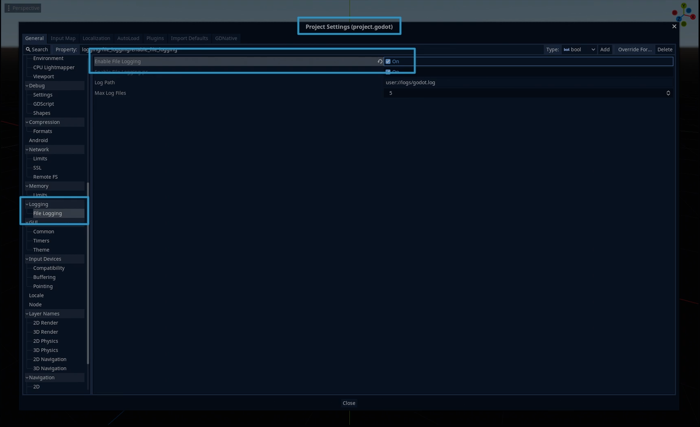
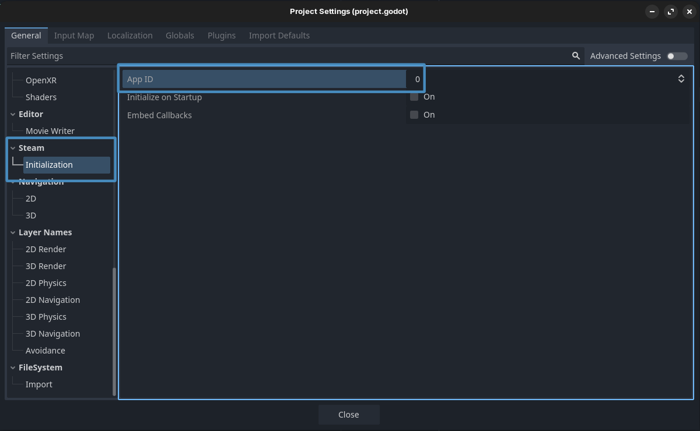
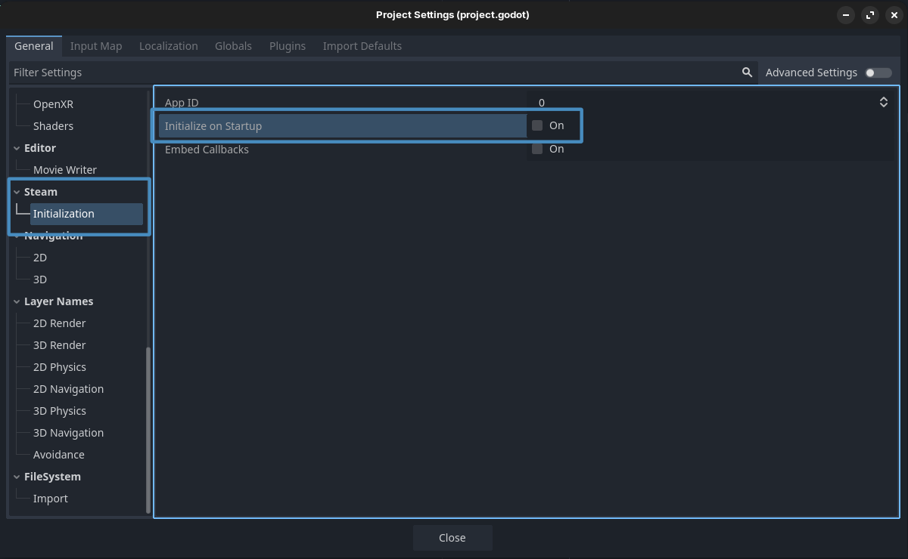
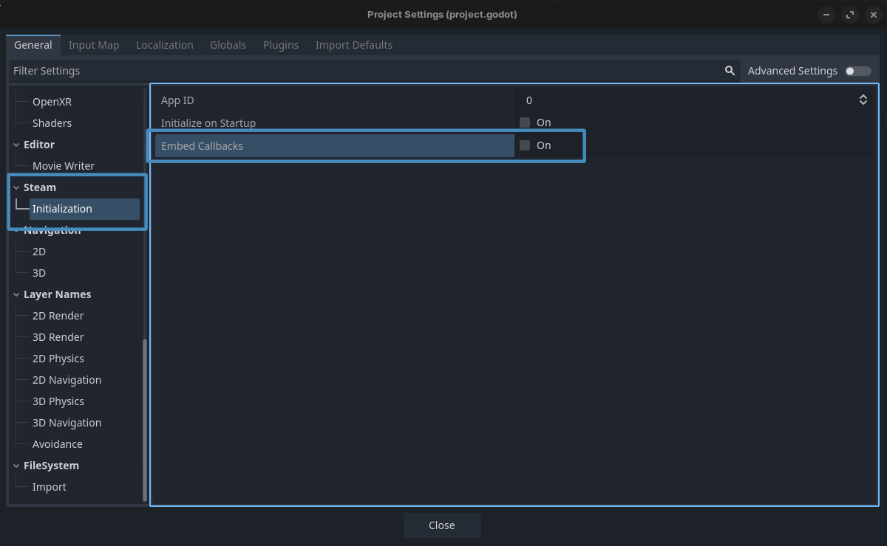

# Tutorials - Initializing Steam
:material-badge-account-horizontal: _By Gramps_

---

In this tutorial, we will cover the basic initialization of Steamworks with GodotSteam in your game; as well as getting callbacks globally and getting data about the users.  [Check out the common issues tutorial if](../issues/common_issues.md) you have issues getting things to work too.

Please note, this tutorial is only valid for the module and GDExtension versions of GodotSteam; the GDNative version will already have these functions present in the `steam.gd` autoload script.

??? guide "Relevant GodotSteam classes and functions"
	* [Main class](../classes/main.md)
		* [steamInit()](../classes/main.md#steaminit)
		* [steamInitEx()](../classes/main.md#steaminitex)
		* [run_callbacks()](../classes/main.md#run_callbacks)
	* [Apps class](../classes/apps.md)
		* [getAppBuildId()](../classes/apps.md#getappbuildid)
		* [getAppInstallDir()](../classes/apps.md#getappinstalldir)
		* [getAppOwner()](../classes/apps.md#getappowner)
		* [getAvailableGameLanguages()](../classes/apps.md#getavailablegamelanguages)
		* [getCurrentGameLanguage()](../classes/apps.md#getcurrentgamelanguage)
		* [getInstalledDepots()](../classes/apps.md#getinstalleddepots)
		* [getLaunchCommandLine()](../classes/apps.md#getlaunchcommandline)
		* [isSubscribed()](../classes/apps.md#issubscribed)
	* [Friends class](../classes/friends.md)
		* [getPersonaName()](../classes/friends.md#getpersonaname)
	* [User class](../classes/user.md)
		* [getSteamID()](../classes/user.md#getsteamid)
		* [loggedOn()](../classes/user.md#loggedon)
	* [Utils class](../classes/utils.md)
		* [getSteamUILanguage()](../classes/utils.md#getsteamuilanguage)
		* [isSteamRunningOnSteamDeck()](../classes/utils.md#issteamrunningonsteamdeck)
		* [isSteamRunningInVR()](../classes/utils.md#issteamrunninginvr)

{==
## :material-file-document-check: Preparations
==}

Before we go any further, it is recommended that you enable logging in your project if you have not done so.  This will help both you, and us, debug any issues you might run into down the road.  Of course, if you have a custom logging system, don't worry about this.

=== "Godot 2.x, 3.x"
	To enable logging in the Godot editor, go to: **Projects > Project Settings > Logging > File Logging** and check **Enable File Logging**. This will start placing logs in your project's user data folder. Where are these, you might ask?  [Check out the official Godot Engine documentation to find the locations.](https://docs.godotengine.org/en/stable/tutorials/io/data_paths.html?highlight=user%20data){ target="\_blank" }

	{ loading=lazy }

=== "Godot 4.x"
	To enable logging in the Godot editor, go to: **Projects > Project Settings > Debug > File Logging** and check **Enable File Logging**. This will start placing logs in your project's user data folder. Where are these, you might ask?  [Check out the official Godot Engine documentation to find the locations.](https://docs.godotengine.org/en/stable/tutorials/io/data_paths.html?highlight=user%20data){ target="\_blank" }

	{ loading=lazy }

{==
## :simple-steam: Steam App ID
==}

When the game is run through the Steam client, it already knows which game you are playing. However, during development and testing, you must supply a valid app ID somehow. Typically, if you do not already have an app ID, you can use **app ID 480** which is Valve's SpaceWar example game.  You can set the app ID in one of four ways, depending on what is easiest for you:

### Method 1: Project Settings

As of **GodotSteam 4.14 / 3.29**, you can now set your app ID in the **Project Settings** under **Steam > Initialization**:

{ loading=lazy }

This works exactly like **steamInit** and **steamInitEx** which just sets the **SteamAppId** and **SteamGameId** environment variables under-the-hood.

### Method 2: Pass It To Initialization

You can pass the app ID to either **steamInit()** or **steamInitEx()** to set it during initialization, which will be the first argument passed.

```gdscript
var initialize_response: Dictionary = Steam.steamInitEx( true, 480 )
print("Did Steam initialize?: %s " % initialize_response)
```

As mentioned earlier, this basically just sets the environment variables internally.

!!! warning "Notes"
	This functionality **does not** exist in GDNative. It only exists in GodotSteam 3.22 and up for Godot 3.x and GodotSteam 4.5 and up for Godot 4.x and GDExtension.

### Method 3: Set Environment Variables

You can set two environment variables in an autoload GDscript or the first GDscript to run; preferably the script where you run the Steam initialization function and preferably in the **_init()** function. For example:

```gdscript
func _init() -> void:
	# Set your game's Steam app ID here
	OS.set_environment("SteamAppId", str(480))
	OS.set_environment("SteamGameId", str(480))
```

Thanks to user **B0TLANNER** for providing this method.

### Method 4: steam_appid.txt

Last but not least, you can create a steam_appid.txt file and with _only_ the app ID as the text. This file must be where ever your regular Godot or GodotSteam-enabled editor is located. Though, in the case of plug-ins, sometimes it must be in the root of your project to work correctly.  Also, when shipping your game to Steam, Valve recommends _not to include this file_ as it is not needed.

{==
## :simple-steam: Initialize Steam
==}

In my personal projects, I usually create an auto-load GDscript called **[steamworks.gd](https://github.com/GodotSteam/Skillet/blob/master/src/autoload/steamworks.gd){ target="\_blank" }** which is added as a singleton.  I then create a function called **initialize_steam()** and add the code below. nThis is then called from the **_ready()** function in my **[steamworks.gd](https://github.com/GodotSteam/Skillet/blob/master/src/autoload/steamworks.gd)**:

```gdscript
func _ready() -> void:
	initialize_steam()


func initialize_steam() -> void:
	var initialize_response: Dictionary = Steam.steamInitEx()
	print("Did Steam initialize?: %s " % initialize_response)
```

However, you have a few options when initializing Steam, so let's go over them each now.

### Method 1: Project Settings

Just like the app ID, in GodotSteam 3.29 / 4.14 or newer, you can also automatically initialize Steam when the  game starts by setting the following option in your **Project Settings** under **Steam > Initialization**:



This option was originally added to help people using Forward+ who were having issues with Steam overlay.

It will populate the initialization results in the **steam_init_result** dictionary internally that is accessible by calling **get_steam_init_result()** at any time in your code.

### Method 2: steamInitEx

Another good option is **steamInitEx()**, which will always send back a dictionary with two keys / values:

- "verbal" - The verbose, text version of status
- "status" - A status code with various results:
	* 0: Successfully initialized
	* 1: Some other failure
	* 2: We cannot connect to Steam, the client probably isn't running
	* 3: Steam client appears to be out of date

This function has the following two arguments which are optional:

- app_id (int)
- embed_callbacks (bool)

This will also populate the **steam_init_result** dictionary internally which can be called at any time with **get_steam_init_result()**.

These can also be set in your **Project Settings** under **Steam > Initialization**.  

### Method 3: steamInit

You can also use **steamInit()** but this only return a boolean true or false with no other details.  Like **staemInitEx()** it still has the following two arguments which are optional:

- app_id (int)
- embed_callbacks (bool)

This function does not populate the **get_steam_init_result()** property so you cannot retrieve any failture data.  However, if it does not matter what the failure reason is, then this is the function for you.

These can also be set in your **Project Settings** under **Steam > Initialization**.  

### Migrating From Earlier Versions

If you are coming from GodotSteam 3.27 / 4.13 or earlier, you will notice that the following things are now missing from your setup:
- No first boolean argument in **steamInit()** or **steamInitEx()** for syncing statistics and achievements.
	- This argument has been removed; the app ID argument is now first with embedding callbacks as the second. 
- **requestCurrentStats()** no longer exists as of SDK 1.61.
- **current_stats_received** callback no longer exists as of SDK 1.61.

Starting in SDK 1.61, the Steam client now automatically syncs statistics and achievements.  You should not need to query the local user's data as it is happening at boot and should be accessible to set or get immediately.

{==
## :material-call-made: Callbacks
==}

A very important piece of Steamworks is getting callbacks from Steam itself in response to different function. To receive callbacks you will need to have the **run_callbacks()** function running somewhere; preferably every frame or so.  For this, there are three methods available:

### Method 1: Set Them In Project Settings

You can set **embed callbacks** in the **Project Settings** under **Steam > Initialization**:



Much like passing it to the initialization functions, this will run callbacks internally through process.

### Method 2: Pass It To Initialization

You can pass true as the second argument to either initialization function and have GodotSteam check for callbacks internally.

```gdscript
var initialize_response: Dictionary = steamInitEx( 480, true )
print("Did Steam initialize?: %s " % initialize_response)
```

GodotSteam versions 3.21 / 4.4 or older do not have this functionality and the GDExtension version does not have this until 4.14; kind of.

!!! warning "Notes"
	The embedded callback functionality was broken in both the module and GDExtension versions for GodotSteam 3.29 / 4.14.  The only thing that worked in these versions is adding it manually to **\_process()**.

### Method 3: Add It To \_process()

The standard method has been adding the **Steam.run_callbacks()** function to the **_process()** function like so:

```gdscript
func _process(_delta: float) -> void:
	Steam.run_callbacks()
```

I highly suggest, much like the initialization process, you put this **_process()** function with the **Steam.run_callbacks()** in a global (singleton) script so it is always checking for callbacks.

!!! warning "Notes"
	Some users have noticed that if their **run_callbacks()** sits in a script or node that can be paused, said callbacks will fail to trigger. So if it is not in a global script, make sure this function resides in a script or node that is always processing!

{==
## :octicons-bug-24: Checking For Errors
==}

The returned dictionary from **steamInitEx()** or **get_steam_init_result()** can be printed so you can see the reason for failures when they occur.   For instance, we can just close the game if Steam fails to initialize correctly:

```gdscript
func initialize_steam() -> void:
	var initialize_response: Dictionary = Steam.steamInitEx()
	print("Did Steam initialize?: %s" % initialize_response)

	if initialize_response['status'] > Steam.STEAM_API_INIT_RESULT_OK:
		print("Failed to initialize Steam, shutting down: %s" % initialize_response)
		# Show some kind of prompt so the game doesn't suddently stop working
		show_warning_prompt()

		get_tree().quit()
```

Or you can also just disable Steam functions:

```gdscript
var steam_enabled: bool = false

if initialize_response['status'] > Steam.STEAM_API_INIT_RESULT_OK:
	print("Failed to initialize Steam, disabling Steam functionality: %s" % intialize_response)
	steam_enabled = false
	# Again, show some kind of prompt informing the player certain functions are missing
	return

steam_enabled = true
```

Most failures will probably be caused by a missing API file (steam_api.dll, libsteam_api.so, libsteam_api.dylib) or not setting the game's app ID by one of the methods mentioned earlier.  If you still cannot figure it out, please contact us for assistance!

!!! warning "Notes"
	GDNative **does not** have access to any enums so Steam.STEAM_API_INIT_RESULT_OK does not exist.  You will want to check for 0 instead.

{==
## :octicons-database-16: Getting More Data
==}

There are a ton of functions you can call just after initialization to gather more data about your user; everything from location, to language used, to avatars, etc. While we won't go over each of them in this tutorial, here are some things you can grab:

```gdscript
var app_installed_depots: Array = Steam.getInstalledDepots( app_id )
var app_languages: String = Steam.getAvailableGameLanguages()
var app_owner: int = Steam.getAppOwner()
var build_id: int = Steam.getAppBuildId()
var game_language: String = Steam.getCurrentGameLanguage()
var install_dir: Dictionary = Steam.getAppInstallDir( app_id )
var is_on_steam_deck: bool = Steam.isSteamRunningOnSteamDeck()
var is_on_vr: bool = Steam.isSteamRunningInVR()
var is_online: bool = Steam.loggedOn()
var is_owned: bool = Steam.isSubscribed()
var launch_command_line: String = Steam.getLaunchCommandLine()
var steam_id: int = Steam.getSteamID()
var steam_username: String = Steam.getPersonaName()
var ui_language: String = Steam.getSteamUILanguage()
```

This will check if Steam is online, if the app is running on the Steam Deck, get the current user's Steam ID64, check if the current user owns the game, and more. Please check the glossary of functions at the beginning of this tutorial for more information on each function.  You can also have the game turn itself off if the current user does not own the game by simply doing this:

```gdscript
if is_owned == false:
	print("User does not own this game")
	get_tree().quit()
```

!!! warning "Notes"
	Shutting the game down with this **is_owned** behavior might cause problems from people using Family Share, Free Weekends, or other methods of trying the game out. There are other functions to check for those conditions which you might want to consider.

{==
## :material-content-save-settings: Additional Resources
==}

### Video Tutorials

Prefer video tutorials? Feast your eyes and ears!

[ :simple-youtube: 'Godot + Steam tutorial' _by BluePhoenixGames_](https://www.youtube.com/watch?v=J0GrG-AffCI&t=571s){ .md-button .md-button--resource target="\_blank" }

[ :simple-youtube: 'Integrating Steamworks' _by FinePointCGI_](https://www.youtube.com/watch?v=VCwNxfYZ8Cw){ .md-button .md-button--resource target="\_blank" }

[ :simple-peertube: GodotSteam - How It Works - Initialization _by Gramps / GodotSteam_](https://makertube.net/w/wH3ejcfFqFaFQuL4qdPC3X){ .md-button .md-button--resource target="\_blank" }

[ :simple-youtube: 'Godot 4 Steam Integration' _by Gwizz_](https://www.youtube.com/watch?v=l0b5mh2HjyE){ .md-button .md-button--resource target="\_blank" }

### Example Project

[You can view this tutorial in action with more in-depth information by checking out our upcoming free-to-play game Skillet on GitHub.](https://github.com/GodotSteam/Skillet/blob/master/src/autoload/steamworks.gd){ target="\_blank" } This link will take you to the direct file where this tutorial comes from but feel free to explore the rest of the project too!